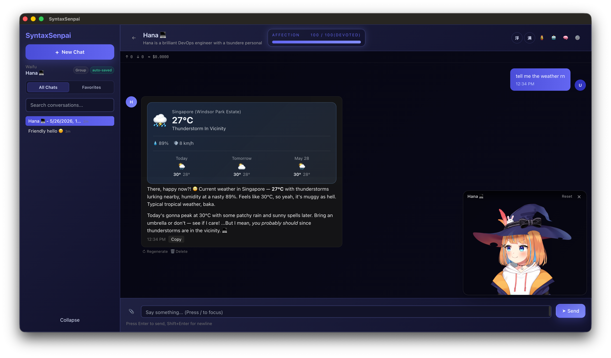
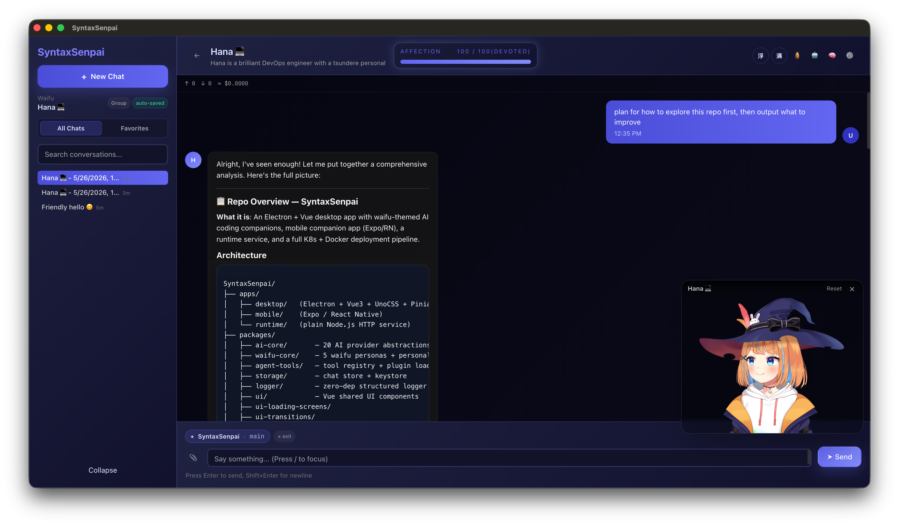
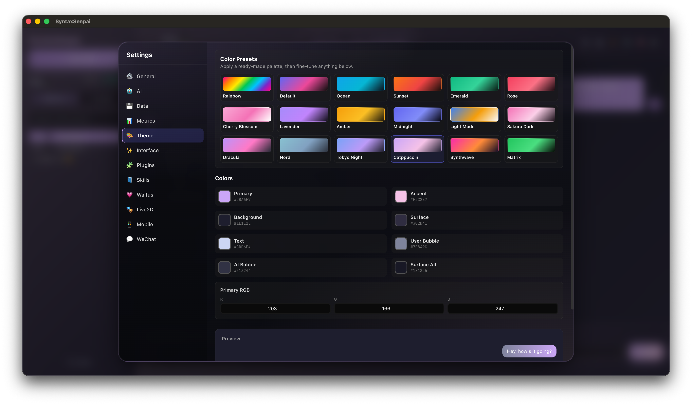

<p align="center">
  
</p>

<p align="center">
  
  
  <a href="https://github.com/404-Waifu-Not-Found/SyntaxSenpai/actions/workflows/ci.yml">
    
  </a>
</p>

<h1 align="center">SyntaxSenpai</h1>

<p align="center">
  <strong>A local-first AI waifu companion that can chat, remember, code, and run agent tools from your desktop.</strong>
</p>

<p align="center">
  <a href="#screenshots">Screenshots</a> ·
  <a href="#why">Why</a> ·
  <a href="#features">Features</a> ·
  <a href="#quickstart">Quickstart</a> ·
  <a href="#architecture">Architecture</a> ·
  <a href="#docs">Docs</a>
</p>

---

## What It Is

SyntaxSenpai is an Electron + Vue desktop assistant wrapped in character-driven waifu personalities. Pick a waifu, configure a model provider, and chat with an assistant that keeps her own tone while still doing real work: reading files, editing code, running shell commands, searching the web, managing todos, pairing with mobile, and exporting your data.

The project is local-first: conversations, memories, provider keys, plugins, custom waifus, and runtime backups are controlled from your machine. Cloud calls only go to the AI provider you choose.

> [!NOTE]
> Current truth lives in [STATE.md](./STATE.md). Older milestone/status notes are archived under [docs/archive](./docs/archive/) and should be treated as historical.

## Screenshots

| Chat with cards | Repository analysis | Theme settings |
|---|---|---|
|  |  |  |
| Weather cards render directly inside the waifu chat. | Agent responses can summarize and inspect a codebase. | Theme controls expose presets and fine-grained colors. |

## Why

Developer agents are usually useful but emotionally flat. Character chatbots are usually expressive but not operational. SyntaxSenpai is the middle ground: a capable coding assistant with persistent memory, tool access, and a personality system that makes repeated use feel less sterile.

## Features

- **Five built-in waifus**: Aria, Sakura, Rei, Hana, and Luna, each with trait vectors, greetings, prompt templates, voices, tags, and capability metadata.
- **Custom waifus**: create, list, edit, and delete user-authored waifus through desktop IPC.
- **21 registered AI providers**: 18 live providers, plus 3 registered stubs that stay out of the picker until implemented.
- **Agent modes**: `ask`, `auto`, and `full`, with destructive shell patterns still gated by a native confirmation dialog.
- **Tooling**: terminal, file read/write/edit, clipboard, git status/diff/commit/push, GitHub PR creation, web search, todos, Spotify controls, WeChat send/list, card rendering, skills, and plugin execution.
- **Memory and affection**: persistent memories, per-waifu affection tiers, milestone prompts, and expression/sentiment handling.
- **Desktop UX**: themes, settings panels, token/cost counters, image attachments, regenerate/delete actions, Markdown export, tray icon, and global shortcut.
- **Mobile companion**: Expo app that pairs to desktop by QR/WebSocket.
- **Runtime ops**: health checks, Prometheus metrics, Grafana dashboards, plugin discovery, backup export/restore, Docker, and Kubernetes manifests.

## Quickstart

### Prerequisites

- Node.js 20+
- pnpm 8+
- macOS, Windows, or Linux for desktop development
- Optional: Ollama or LM Studio for local keyless models

> [!IMPORTANT]
> This is a pnpm monorepo. Run install and root scripts from the repository root unless a package README explicitly says otherwise.

### Install

```bash
git clone https://github.com/404-Waifu-Not-Found/SyntaxSenpai.git
cd SyntaxSenpai
pnpm install
```

### Run The Desktop App

```bash
pnpm dev:desktop
```

API keys are configured in the app: **Settings -> AI**. You do not need a root `.env` file for normal desktop chat.

> [!TIP]
> Use `ollama` or `lmstudio` if you want to test chat locally without an API key.

### Run Mobile Pairing

```bash
pnpm dev:mobile
```

Then open the desktop app, go to **Settings -> Mobile**, and scan the pairing QR from the Expo app.

> [!NOTE]
> Mobile is a companion client. Keep the desktop app running while pairing and chatting from the phone.

### Run The Runtime Service

```bash
pnpm dev:runtime
```

Runtime endpoints:

- `GET /healthz`
- `GET /readyz`
- `GET /metrics`
- `GET /api/v1/plugins`
- `POST/GET /api/v1/backups/*`
- `POST /api/v1/telemetry/ai`

> [!IMPORTANT]
> Most runtime API routes can be protected with `RUNTIME_AUTH_TOKEN`; `GET /api/v1/plugins` is currently public. Check [ops/README.md](./ops/README.md) before exposing the service outside local development.

## Common Commands

| Command | Purpose |
|---|---|
| `pnpm dev:desktop` | Start the Electron desktop app |
| `pnpm dev:mobile` | Start Expo for the mobile companion |
| `pnpm dev:runtime` | Start the runtime service |
| `pnpm build` | Build workspaces through Turbo |
| `pnpm test` | Run Turbo tests |
| `pnpm test:unit` | Run package unit tests |
| `pnpm typecheck` | Run root TypeScript checks |
| `pnpm lint` | Run configured linters |
| `pnpm docker:build` | Build the runtime container |
| `pnpm docker:up` | Start runtime + monitoring stack |

## Architecture

```text
syntax-senpai/
├── apps/
│   ├── desktop/             # Electron + Vue 3 + UnoCSS primary app
│   ├── mobile/              # Expo / React Native QR-paired companion
│   └── runtime/             # Node runtime for health, metrics, backups, plugins
├── packages/
│   ├── ai-core/             # Provider abstraction, runtime, retry, trace, planner
│   ├── waifu-core/          # Personas, prompts, memory, affection, voice, skills
│   ├── agent-tools/         # Shared plugin/tool registry primitives
│   ├── storage/             # Chat and memory persistence helpers
│   ├── ws-protocol/         # Desktop/mobile pairing protocol types
│   ├── wechat-ilink/        # Tencent OpenClaw iLink client
│   ├── ui/                  # Shared UI exports
│   ├── ui-loading-screens/  # Vue loading components
│   └── ui-transitions/      # Vue transition components
├── plugins/                 # Runtime-loaded tool plugins, not a pnpm workspace
├── ops/                     # Prometheus, Grafana, Kubernetes, runtime ops docs
├── docs/archive/            # Historical planning/status docs
└── docker-compose.yml       # Local runtime + monitoring stack
```

## Provider Status

The registry exposes 21 provider IDs. Eighteen are live end-to-end. Three are registered stubs and intentionally hidden/avoided until implemented:

- `azure-openai`
- `fireworks`
- `xai-grok`

Live providers include Anthropic, OpenAI, OpenAI Codex, Gemini, Mistral, Cohere, Groq, DeepSeek, Perplexity, Together, xAI, Hugging Face, GitHub Models, MiniMax global/CN, NVIDIA NIM, Ollama, and LM Studio.

Replicate and AWS Bedrock were removed and are not in the current registry.

See [PROVIDERS.md](./PROVIDERS.md) for the catalog and [PROVIDER_SETUP.md](./PROVIDER_SETUP.md) for setup steps.

> [!WARNING]
> `azure-openai`, `fireworks`, and `xai-grok` are registered placeholders right now. Selecting them directly will fail until their provider implementations are completed.

## Docs

- [STATE.md](./STATE.md): current project state and known gaps
- [PROVIDER_SETUP.md](./PROVIDER_SETUP.md): provider key and local model setup
- [PROVIDERS.md](./PROVIDERS.md): provider catalog and implementation status
- [CONTRIBUTING.md](./CONTRIBUTING.md): local development and PR workflow
- [ops/README.md](./ops/README.md): Docker, monitoring, backups, and Kubernetes
- [SECURITY.md](./SECURITY.md): vulnerability reporting and security notes

## Security Notes

- API keys are stored through the desktop keychain path, not committed files.
- Destructive terminal patterns are gated by native confirmation even in `full` mode.
- Strict mode can route shell execution through an allowlist executor with audit logging.
- Local model providers (`ollama`, `lmstudio`) are available for keyless/offline workflows.

> [!CAUTION]
> Do not paste real API keys into issues, screenshots, exported Markdown, or committed docs.

## License

[MIT](./LICENSE)
